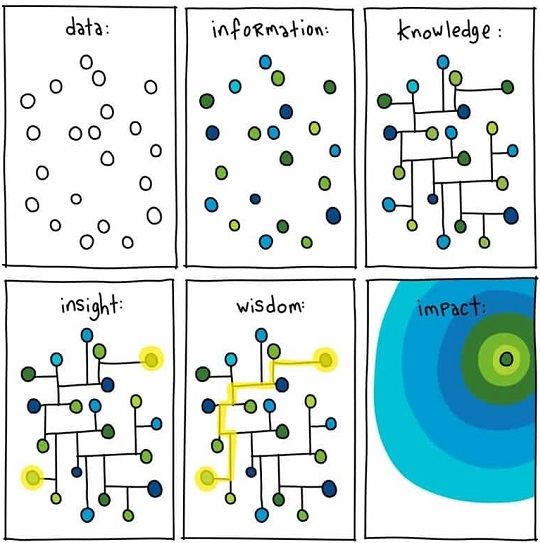

<div align="center" id="top"> 
  

  &#xa0;

</div>

<h1 align="center">Tez Araştırma Çalışma Alanı</h1>

<p align="center">
  

  

  

  <!--  -->

  <!--  -->
  
  <!--  -->
  
  <!--  -->

</p>


<p align="center">
  <a href="#dart-açıklama">Açıklama</a> &#xa0; | &#xa0; 
  <a href="#sparkler-linkler">Linkler</a> &#xa0; | &#xa0;
  <a href="#octocat-araçlar">Araçlar</a> &#xa0; | &#xa0;
  <a href="#surfer-gantt-chart">Gantt Chart</a> &#xa0; | &#xa0;
  <a href="#mag_right-okunacaklar">Okunacaklar</a> &#xa0; | &#xa0;
  <a href="#art-yöntem">Yöntem</a> &#xa0; | &#xa0;
  <a href="#dvd-veriler">Veriler</a> &#xa0; | &#xa0;
  
  <!-- <a href="#dizzy-04-bilgisayar-ağları">04 Bilgisayar Ağları</a> &#xa0; | &#xa0;
  <a href="#art-05-işletim-sistemleri">05 Işletim Sistemleri</a> &#xa0; | &#xa0;
  <a href="#twisted_rightwards_arrows-06-sayısal-tasarım">06 Sayısal Tasarım</a> &#xa0; | &#xa0;
  <a href="#fish_cake-07-yazılım-mühendisliği">07 Yazılım Mühendisliği</a> &#xa0; | &#xa0;
  <a href="#dvd-08-veritabanı">08 Veritabanı</a> &#xa0; | &#xa0;
  <a href="#factory-09-bilgisayar-mimarisi">09 Bilgisayar Mimarisi</a> &#xa0; | &#xa0;
  <a href="#sparkles-10-yapay-zeka">10 Yapay Zeka</a> &#xa0; | &#xa0;
  <a href="#memo-lisans">Lisans</a> &#xa0; | &#xa0;
  <a href="https://github.com/otahsinb" target="_blank">Yazar</a> -->
</p>

<br>

## :dart: Açıklama ##

Bu alan bilgisayar bilimleri doktora yayın çalışmalarımı kaydetme amacıyla kendim için açtığım bir alandır.
 
First there's [here](https://pyob.oxyry.com/) but.\
:heavy_check_mark: Dersler ve Konu Başlıkları \
:heavy_check_mark: Linkler \
:heavy_check_mark: Kullanışlı Araçlar\
:heavy_check_mark: Sınavlar\
:heavy_check_mark: Notlar


## :sparkler: Linkler ##
   Link 1: [Decoding Grounded Theory for Software Engineering](https://www.youtube.com/watch?v=k980eEJKKvU) -  Rashida Hoda 2021
   
   Literatürde 3 çeşit GT versiyonu vardır.
   
   Bu 3 versiyon iyi anlaşılmalıdır.\
   GT aslında imperical ya da evidence based nature theory'e dayanır. 
   
   
  
   Yukarıdaki çalışmalarda GT temellerinden bahsediyor yazar.
   
   Öz:\
   GT Alanındaki tecrübeniz nedir sorusu ile başladı.\
   GT soslolojikal bir method/process/lifecycle/set of stepsdir.1967 yılında Barney Glaser ve Anselm Strauss tarafından tanıtılmıştır (Discovery of Grounded Theory: Strategies for Qualitative Research: kütüphanelerden temin edilebilir). Nitel araştırmalar için güçlü olduğu vurgulanmıştır.\
   Systematic ve rigourous bir yaklaşımdır.\
   Focuses on in-depth research of social phenomenon.\
   Inductive approach to evidence-based theory generation. which means collecting up evidence from real world and builing up the theory that bottom mark.\
   Has a powerful data analysis method at its score. Bazen sadece data analizi için kullanılabilir.\
   *Theory*
   Data içerisindeki key-patternler nelerdir? \
   What are the relationships between patterns? What are the emergent hypotheses? Aralarındaki linkler nelerdir?\
   GT outcome'ı hypothesis değildir, theorydir. Rigorous bir process'tir.\   
 
   

   
   
   Link 2: Software process improvement (Coleman and O'Connor, 2007)
   ```bash
   Öz: This research focuses on complex phenomenon.
   ```
   
   Link 3: Customer collaboration (Hoda et al., 2011)
   Self-organizing teams (Hoda et al., 2012)
   Multi-level project management challenges (Hoda and Murugesan, 2016)
   Agile transformation (Hoda and Noble, 2017)
   ```bash
   Öz: .
   ```
   
   Link 4: Reconciling perspectives (Adolph et al., 2012)
   ```bash
   Öz: ...
   ```
   
   Link 5: Software product management challenges (Jantunen and Gause, 2014)
   ```bash
   Öz: ...
   ```
   
   Link 5: Agile architecture (Waterman et al., 2015)
   ```bash
   Öz: ...
   ```
   
   Link 6: Daily standup meeting (Stray et al., 2016)
   ```bash
   Öz: ...
   ```
   
   Link 7: Self-assignment (Masood et al., 2020)
   Scrum variations (Masood et al., 2020)
   ```bash
   Öz: ...
   ```
   
   Link 8: Role of scrum master (Shastri et al., 2021)
   Role of project manager (Shastri et al., 2021)
   ```bash
   Öz: ...
   ```
   
<a href="#top">Back to top</a>


## :octocat: Araçlar ##
...

<a href="#top">Back to top</a>

## :surfer: Gantt Chart ##

...


<a href="#top">Back to top</a>

## :mag_right: Okunacaklar ##

...


<a href="#top">Back to top</a>

## :art: Yöntem ##

...


<a href="#top">Back to top</a>

## :dvd: Veriler ##

...


<a href="#top">Back to top</a>


## :memo: Lisans ##

This project is under license from MIT. For more details, see the [LICENSE](LICENSE) file.


Made with :hammer: by <a href="https://github.com/otahsinb" target="_blank">otahsinb</a>

&#xa0;

<a href="#top">Back to top</a>
